# Présentation
Unity est un moteur de jeu multiplateforme (smartphone, ordinateur, consoles de jeux vidéo et Web) développé par Unity Technologies. Il est l'un des plus répandus dans l'industrie du jeu vidéo, aussi bien pour les grands studios que pour les indépendants du fait de sa rapidité aux prototypages et qu'il permet de sortir les jeux sur tous les supports.

Il a la particularité de proposer une licence gratuite dite « Personal » avec quelques limitations de technologie avancée au niveau de l'éditeur, mais sans limitation au niveau du moteur.

Dans le cadre d'une utilisation d'un casque de réalité virtuel (Oculus Quest) pour la safety box, nous avons prototypé sur Unity.

# Installation et Préparation de Unity VR

### Windows
Pour commencer télécharger Unity Hub et Unity Editor [ici](https://unity3d.com/fr/get-unity/download),
pendant le téléchargement il vous proposera plusieurs modules à installer en plus comme Visual studio, android, ios ... Sélectionner Visual studio et android et laisser le reste par défault.

### Linux
1. On va télécharger l'installeur depuis [ce lien](https://forum.unity.com/threads/unity-on-linux-release-notes-and-known-issues.350256/page-2#post-4009651) et copier le dernier lien du tuto pour ensuite faire cette commande  
"wget le lien" On remplace le lien par le plus récent sur le forum.
2. On exécute l'installeur et on suis les instructions.
3. On télécharge le fichier AppImage du Unity Hub [ici](https://unity3d.com/get-unity/download) et on l'exécute.
4. On suis les instructions et on oublie pas de sélectionner en plus Android et Linux.

#### Visual Studio Code
Sur Linux nous avons besoin de lier Visual Studio Code avec Unity, pour cela il va nous falloir plusieurs choses :

1. Installer Visual Studio Code via [ce lien](http://doc.ubuntu-fr.org/visual_studio_code)
2. Ouvrez Visual Studio Code (grâce a la commande "code")
3. Sectionnez le menu "extensions"
4. Cherchez le plugin "Unity3d-pack", et installer le
5. Cherchez le plugin "vscode-solution-explorer", et installer le
6. Ouvrez un projet Unity
7. Allez dans les menus : Edit → Preferences → External Tools
8. Cliquez sur "External Script Editor" → "browse"
9. Allez dans les dossiers /usr/bin, et sélectionnez l’exécutable "code"

### Setup
Attention si vous avez un VPN d'activé il se peut que vous ayez des problèmes avec Unity. Si jamais c'est le cas désactiver le.

Avant de commencer à développer sur Unity, il faut faire quelques préparations:
1. En premier il faut changer de plateforme d'exportation et passer sur Android, (car l'Oculus Quest est sous une base android, il faut donc lui envoyer des fichiers APK). Aller dans l'onglet file/Build Settings, ensuite sélectionner Android et cliquer sur switch platform.

2. Ensuite nous devons paramétrer Unity de tel sorte à ce qu'il supporte la réalité virtuel. Vous devez aller dans edit/Project Settings, ensuite dans l'onglet Player et sélectionner Android et pour finir XR Settings, cocher Virtual Reality supported et avec le + ajouter Oculus.  

   

3. Pour finir il faut importer un package, donc on va dans Window/Asset Store et dans la barre de recherche taper "Oculus Integration" et importer le.

Maintenant tout est en place pour commencer à développer sur Unity.

# Premier pas sur Unity
Nous avons plusieurs onglets Sur Unity :

- Notre scene
- Le point de vu de la caméra
- Le dossier projet
- L'inspector
- La hierarchie de notre projet.

Commençons par créer notre environnement de test. Pour démarrer on supprime "main camera" dans Hierarchy (nous utiliserons une camera adapté pour la réalité virtuel). Ensuite dans la barre de recherche du dossier project taper "OVRPlayerController" et faire un glissé déposé du préfab dans Hierarchy. Après avec Inspector on met la position à 0 pour x, y et z pour centrer notre caméra (on recule un peu la caméra en arrière).

Pour continuer on effectue un clic droit dans hierarchy puis on crée un "plane" et un "cube" avec 3D object. A la suite de cela mettre leurs positions à 0 (avec l'inspector). Et enfin on crée d'autres cubes plus petit et on agrandi le premier (Bonus : dans l'Asset du project, créer un "material" Red et Black, Et attribuer ces couleurs et avec un glisser déposer sur le grand cube et sur le sol) pour obtenir ceci :

On clic sur OVRPlayerController, dans l'inspector on fait "Add Component" et on écrit "camera constraint" une fois ajouté on fait un glissé déposer de "OVRCameraRig" dans Camera Rig (voir ci-dessous).

 

Et enfin on sélectionne tout nos petit cubes et dans inspector on fait "Add Component" on ajoute OVR Grabbable et Rigidbody. Et voilà, il ne nous reste plus qu'à l'exporter et c'est finis.

 

Pour l'exporter, il suffit d'aller dans file/Build Settings et ensuite on clic sur build. 

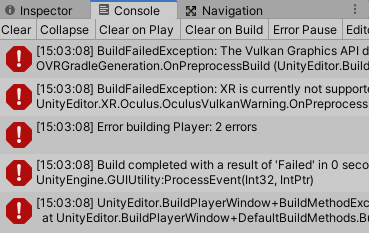

Aie des erreurs sont apparues ! Pour régler cela et exporter notre projet au format APK, il faut aller dans edit/Project Settings, ensuite dans l'onglet Player sélectionner Android et pour finir supprimer Vulkan avec - depuis Other Settings. Maintenant on retourne sur l'onglet et le build marche correctement.

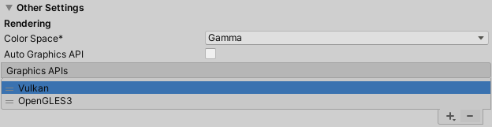

Support Vidéo : https://youtu.be/sKQOlqNe_WY

# Installer le test sur l'Oculus Quest
Pour pouvoir installer notre test, il faut d'abord mettre notre Oculus en mode développeur pour lui faire accepter les sources inconnues. Ensuite l'installer par le biais d'une application.

### Configuration de l'Oculus Quest en mode développeur
1. Aller sur https://dashboard.oculus.com/ et connecter vous.
2. Créer une nouvelle organisation.
3. Ajouter un nom a votre organisation.
4. Lancer l'application Oculus depuis votre téléphone. Dans les paramètres, selectionner votre casque, connecter vous via Bluetooth, Ensuite cliquer sur Autres Paramètres/ Développeur et activer le.

 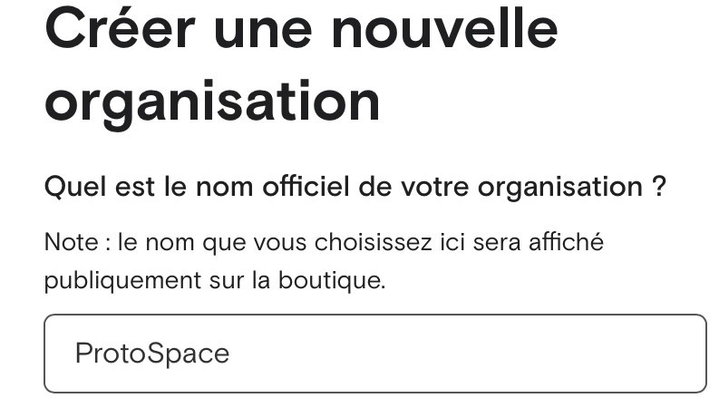

### SideQuest
SideQuest est un outil permettant aux développeurs d’applications VR de proposer leurs jeux sur Oculus Quest sans l’approbation de Facebook. Il permet aussi de mettre ses projets APK sur son Quest.

Pour installer SideQuest : https://sidequestvr.com/

### Connection à SideQuest
Pour Installer notre fichier APK sur l'Oculus, il faut connecter le casque au PC avec un cable usb. Une fois branché lancer l'application SideQuest et si tout vas bien l'oculus est connecté au PC.

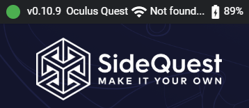

Si vous n'etes pas connecté vous aurez besoin d'accepter des autorisations depuis le casque. 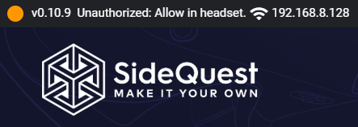

Une fois connecté on peut se déplacer et installer les jeux que l'on souhaites très facilement comme dans un store.

### Installation de notre premier test
Pour installer notre test nous utiliserons uniquement ces deux icones (celle de gauche pour installer des APK et l'autre pour désinstaller des fichiers de notre casque). 

On clique sur l'icone de gauche et on sélectionne le fichier APK que l'on a build précédement. Un message apparait en bas une fois le téléchargement terminé. Pour regarder les tâches en cours il suffit de cliquer sur l'icone de liste avec un v. 

Une fois le téléchargement finis, il ne nous reste plus qu'à aller dans la bibliothèque de notre casque et dans source inconnues pour lancer notre test. Mais faire cela à chaque fois que l'on souhaite tester notre projet cela deviens long, c'est pourquoi il existe une façon de tester sans perdre tout ce temps. La solution l'Oculus Link.

# Oculus Link
Oculus Link permet de brancher votre Oculus Quest sur votre PC via un câble USB afin que ce dernier soit reconnu comme un Oculus Rift Standard. Le but étant de pouvoir accéder à son ordinateur via le casque, mais aussi d’avoir accès à des jeux et applications plus gourmandes en exploitant la puissance de votre ordinateur. Malheureusement l'application Oculus n'est pas encore disponible pour Linux (peut être en utilisant Wine il y aurait moyen d'avoir l'appli sur Linux, à tester). 

### Configuration
Oculus Link nécessite un câble USB de haute qualité. Il est recommandé d’utiliser un câble USB 3.0 de type C à C ou de type A à C de haute qualité et aux performances reconnues, mais aussi avoir une certaine configuration PC voir [ici](https://support.oculus.com/444256562873335/).

Pour se connecter rien de plus simple, une fois votre casque reconnu par l’application PC, l’Oculus détecte automatiquement votre ordinateur et vous propose de passer sur la fonctionnalité Oculus Link Beta. En acceptant, vous vous retrouvez dans l’environnement VR propre à l’Oculus Rift avec un accès complet à son catalogue de jeux.

Important si vous voulez tester vos jeux sur Unity avec Oculus link en plus de [ça](https://github.com/lafritemema/alban_unity_rep#setup) faire la partie 2 pour Windows aussi.

# Projet Setup
Ce petit projet a pour but de tester plusieurs choses, voir ce qu'il est possible de faire, prototyper.

### Configuration de la caméra

#### Préfabs
En important Oculus Integration depuis l'Asset Store, nous avons accès à "OVRPlayerController" C'est un préfabs ou nous avons besoin de configurer uniquement le tracking origin mode sur floor (pour régler la caméra en fonction de la distance du casque et du sol).

#### Manuel
1. Avec clic droit dans Hierarchy Créer un "Empty", et renommer le VR Rig.
2. Faites "Add Component" et taper XR Rig.
3. Créer une caméra "Camera Offset" à la racine de VR Rig, et une autre caméra "VR camera" à la racine de l'autre caméra et avec "Add Component" ajouter Tracked Pose Driver.
4. Faire un glissé déposé des caméras dans le component XR Rig de l'Empty.

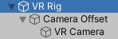 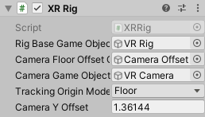

### Configuration des mains

#### Préfabs
Avec Oculus Integration nous avons "CustomHandLeft" et "CustomHandRight", et on a juste a faire un glissé déposé dans le model prefab de "Left Hand" et "Right Hand".

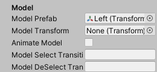

#### Manuel
1. Créer deux Empty à la racine de Camera Offset et renommer les Left Hand et Right Hand. 
2. Selectionner les et ajouter XR Controller avec "Add Component", configurer controller node sur right hand ou left hand en fonction de la main.

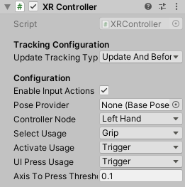

3. Vous pouvez soit importer des mains soit en créer vous même avec des formes pour ensuite faire un glissé déposé dans le model prefab de Left Hand et Right Hand.

### Grab

#### Préfabs
Avec l'oculus integration le grab est déjà inclus pour interagir avec des objets il y a juste a leurs rajouter "OVR Grabbable Script" via "Add Component" depuis l'onglet Inspector.

#### Manuel
Ajouter "XR Direct interactor" et "Sphere collider" via "Add Component" sur Left hand et Right hand. Ensuite pour Sphere collider mettre le Radius à 0.2, et cocher" Is Trigger".

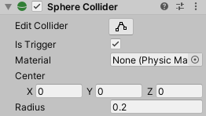

Si vous voulez attrapper un objet il suffit de lui ajouter XR Grabbable via "Add Component".

### Interaction

#### Préfabs
Nous allons intéragir avec une porte de commode. Pour ce faire installer le prefab [ici](https://drive.google.com/file/d/18AU3DCQzmYgYekg_0-VYmnOQOcV7mftR/view). Une fois téléchargé et importé sur Unity sélectionner "Door" dans Cabinet et avec "Add Component" ajouter XR Grabbable (ou "OVR Grabbable Script" en fonction de si vous avez fait une configuration "Prefabs" ou "Manuel") , puis faire un glissé déposé du "door handler" dans collider et mettre le "movement type" sur Velocity tracking.

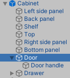 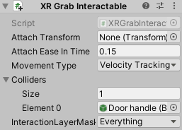

Toujours dans Door on ajoute Hinge Joint via "Add Component" (le but étant de faire tourner la porte autour d'un point fixe). En cliquant sur Edit angular limits on peut apercevoir et modifier le point fixe sur lequel tournera la porte. Mettre les même paramètres "Anchor" et "Axis" que moi, enfin cocher "use limits" pour limiter la rotation de la porte (voir photo ci dessous).

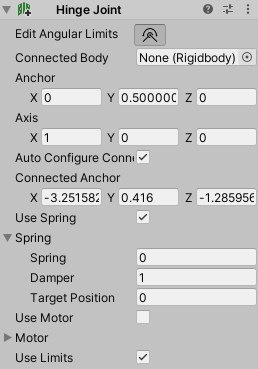 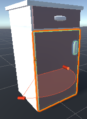

Dans ce cas on avait un handler pour la porte, si jamais on veut faire une porte ou quelque chose qui coulisse mais sans avoir de poigné, ou d'objet pour intéragir avec, on peut en faire un. 

#### Manuel
Tout d'abord, on créer un cube avec la forme d'une poigné (par exemple), et avec "Add Component" on ajoute "Fixed Joint" et "XR Grabbable". Dans la partie "connected body" on fait un glissé déposer de la porte (ou de l'objet avec lequel on veut fixer notre forme). Comme cela on a une forme que l'on peut attraper et qui est fixé à notre porte. On peut maintenant intéragir avec elle. (Optionnel : on peut le rendre invisible pour avoir l'impression d'attraper la poigné en décochant Mesh Renderer).

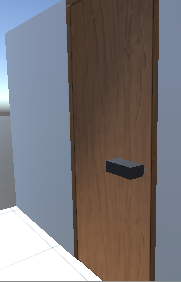  

### Déplacement

#### Préfabs
Avec l'OVRPlayerController le déplacement est déjà actif, donc nous n'avons rien besoin de faire.

#### Manuel
Il faut coder en C#. Pour commencer on créer un script avec "Add component" ensuite on y insert ce texte :

     using System.Collections;
     using System.Collections.Generic;
     using UnityEngine;
     using UnityEngine.XR;
     using UnityEngine.XR.Interaction.Toolkit;
     
     
     public class Movement : MonoBehaviour
     {
         public float speed = 1;
         public XRNode inputSource;
         public float gravity = -9.81f;
         public LayerMask groundLayer;
         public float additionalHeight = 0.2f;

         private float fallingSpeed;
         private XRRig rig;
         private Vector2 inputAxis;
         private CharacterController character;

         // Start is called before the first frame update
         void Start()
         {
             character = GetComponent<CharacterController>();
             rig = GetComponent<XRRig>();
         }

         // Update is called once per frame
         void Update()
         {
             InputDevice device = InputDevices.GetDeviceAtXRNode(inputSource);
             device.TryGetFeatureValue(CommonUsages.primary2DAxis, out inputAxis);
         }

         private void FixedUpdate()
         {
             CapsuleFollow();

             Quaternion headYaw = Quaternion.Euler(0, rig.cameraGameObject.transform.eulerAngles.y, 0);
             Vector3 direction = headYaw * new Vector3(inputAxis.x, 0, inputAxis.y);

             character.Move(direction * Time.fixedDeltaTime * speed);

             bool isGrounded = CheckIfGrounded();
             if (isGrounded)
                 fallingSpeed = 0;
             else
                 fallingSpeed += gravity * Time.fixedDeltaTime;
             character.Move(Vector3.up * fallingSpeed * Time.fixedDeltaTime);
         }

         void CapsuleFollow()
         {
             character.height = rig.cameraInRigSpaceHeight + additionalHeight;
             Vector3 capsuleCenter = transform.InverseTransformPoint(rig.cameraGameObject.transform.position);
             character.center = new Vector3(capsuleCenter.x, character.height/2 + character.skinWidth, capsuleCenter.z);
         }

         bool CheckIfGrounded()
         {
             Vector3 rayStart = transform.TransformPoint(character.center);
             float rayLenght = character.center.y + 0.01f;
             bool hasHit = Physics.SphereCast(rayStart, character.radius, Vector3.down, out RaycastHit hitInfo, rayLenght, groundLayer);
             return hasHit;
         }
     }

### Téléportation
1. Pour commencer on ajoute Locomotion System et Teleportation Provider via "Add Component sur VR Rig.
2. Ensuite on créer un Ray Interactor (XR/Ray Interactor) pour chaque main, et on change controller node en fonction de la main et on le place à la racine de camera offset (on peut modifier "Select Usage" pour utiliser la téléportation sur un bouton en particulier.
3. On créer une zone de téléportation (XR/Teleportation Area), on peut aussi ajouter le script "Teleportation Area" sur un objet via "Add Component" pour créer une zone de téléportation.

Le problème c'est que nous avons un rayon tout le temps dans la main et pas de cercle de téléportation. Nous allons maintenant changer la forme du rayon le rendre invisbible si innactif et ajouter un cercle de téléportation pour obetnir ceci :

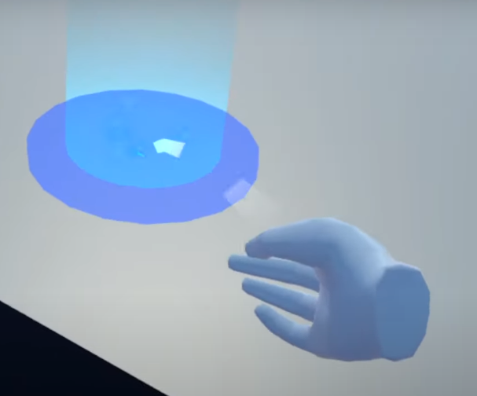

#### Changement de forme
Dans "XR Ray Interactor" on change de "Line Type" pour "Projectile Curve" avec une valeur pour Velocity de 8.

#### Ajout du cercle
1. On créer un cylinder et on lui retire capsule collider.
2. On règle sa taille.
3. On ajoute un material avec un shader "Universal Render Pipeline/Unlit" avec un "Surface Type" Transparent.(J'ai mis une couleur bleu).
4. On sélectionne nos deux Teleport Ray et on fait un glissé déposé du cylinder dans la partie "Reticle" de XR interactor Line visual.

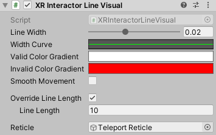

On peut customiser encore plus notre cercle mais en suivant le tuto j'ai rencontré quelques problèmes que je n'ai pus régler.

#### Activation
Dans VR Rig on créer un script (je l'ai appelé Controller) et on y insert ceci :

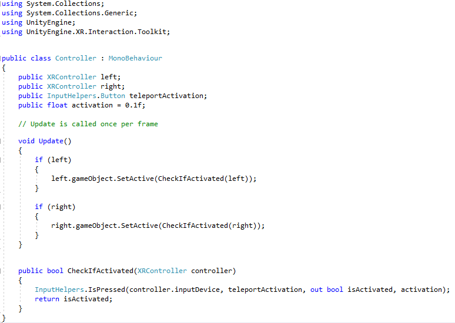

# Modification Environnement
Actuelement il est possible de modifier son environnement virtuel avec les trois que proposes Oculus. Mais en bidouillant un peu on peu créer et importer son propre environnement virtuel.

### Suppression des environnements existants, installation de nouveaux environnements
Une fois que vos environnements personnalisés sont téléchargés et prêts à être installés, suivez ces étapes :

1. Connectez votre Quest à votre ordinateur et ouvrez SideQuest, accédez à la section « Applications actuellement installées » en haut à droite de la barre de navigation

2. Utilisez la fonction de recherche pour rechercher « environnement », Cela devrait donner : un paquet pour la maison classique (Rift Home), un pour le Winter Lodge et maintenant un pour la station spatial. Cliquez sur le rouage à côté de celui que vous voulez remplacer, et appuyez sur « Désinstaller l’application » dans la fenêtre qui s’ouvre.

Certains environnements téléchargés vous permettent de choisir un téléchargement pour le Winter Lodge ou Classic Home, tandis que d’autres ne le font pas et vous obligent à remplacer l’un ou l’autre par l’environnement personnalisé. La plupart des liens de téléchargement l’indiqueront clairement, avec un titre tel que « Custom Simpsons Home – Living Room (Winter Lodge) ».

3. Localisez votre environnement personnalisé .apk
Une fois que vous avez désinstallé les environnements existants, comme indiqué à l’étape 2, il suffit de faire glisser et de déposer votre fichier .apk d’environnement personnalisé dans la fenêtre de SideQuest. L’environnement personnalisé sera alors installé à la place de l’ancien.

Une fois installé, vous pouvez changer d’environnement dans l’onglet Environnements virtuels de vos paramètres.

# Hands Tracking Project
Le suivi des mains (Hands Tracking), permet à l'utilisateur d'utiliser ses mains à la place des manettes. Pour utiliser le hands tracking il faut (si ce n'est pas déjà fait) aller dans les paramètres du casque et activer le suivi des mains.

### Configuration
Pour configurer le hands tracking sur Unity c'est très simple, il faut simplement :
1. Importer "OVRCameraRig", dans la partie "OVR Manager" selectionner hands only sur hands tracking supported.
2. Target devices -> Quest.
3. Tracking origin type -> Floor level.

Attention il y a quelques changements de position avec les versions récentes de Unity (la forme change mais pas le fond).

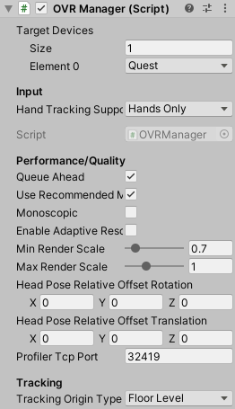

### Hands Draw
Pour la suite vous devez importer le package "VR Draw" situé dans le dossier "Package" (faire un glissé déposé du package dans Asset).

On cherche OVRHandPrefab et on fait un glissé déposé dans LeftHandAnchor et RightHandAnchor et on modifie leur nom et les paramètres en fonction de la main (OVR Hand, Skeleton et Mesh). Ensuite on crée deux Empty que l'on place dans dans tracking spaceet que l'on renome VRDrawRight et left. Après on sélectionne les deux et on ajoute le script "VR Hand Draw" et là aussi on change les paramètres en fonction de la main (attention dans le tuto vidéo il utilise VR Draw mais cela ne marche pas il faut utiliser le VR Hand Draw). On doit obtenir ceci :
 
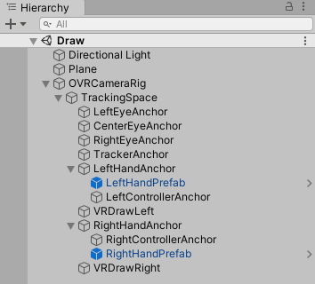 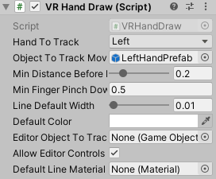

Maintenant On fait un glissé déposé de LeftHandPrefab et RightHandPrefab vers "Object to track movement" qui est dans VRDrawRight et VRDrawLeft. Ensuite on clic sur le plus de "default line material" de VRDrawLeft et Right et on selectionne lineleft ou right en fonction de la main. Et maintenant nous pouvons dessiner en vr avec le suivi des mains.

Tuto Vidéo [ici](https://youtu.be/A02vzFooYj8)

Source utilisé pour cette documentation : [Valem](https://www.youtube.com/c/ValemVR/videos),  [Dilmer](https://www.youtube.com/c/DilmerValecillos/videos)
