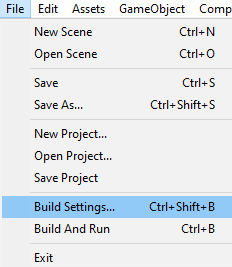

# Présentation
Unity est un moteur de jeu multiplateforme (smartphone, ordinateur, consoles de jeux vidéo et Web) développé par Unity Technologies. Il est l'un des plus répandus dans l'industrie du jeu vidéo, aussi bien pour les grands studios que pour les indépendants du fait de sa rapidité aux prototypages et qu'il permet de sortir les jeux sur tous les supports.

Il a la particularité de proposer une licence gratuite dite « Personal » avec quelques limitations de technologie avancée au niveau de l'éditeur, mais sans limitation au niveau du moteur.

Dans le cadre d'une utilisation d'un casque de réalité virtuel (Oculus Quest) pour la safety box, nous avons prototypé sur Unity.

# Installation et Préparation de Unity
Pour commencer télécharger Unity Hub et Unity Editor [ici](https://unity3d.com/fr/get-unity/download)
Pendant le téléchargement il vous proposera plusieurs module a installer en plus comme Visual studio, android ios ... Sélectionner Visual studio et android et laisser le reste par défault.

### Setup
Avant de commencer à développer sur Unity, il faut faire quelques préparations:
1. En premier il faut changer de plateforme d'exportation et passer sur Android, (car l'oculus quest est sous une base android, donc il faut lui envoyer des fichiers APK). Pour le faire aller dans l'onglet file/Build Settings, ensuite sélectionner android et cliquer sur switch platform.

          

2. Ensuite nous devons paramétrer unity de tel sorte à ce qu'il supporte la réalité virtuel. Vous devez aller dans edit/project setting et après aller dans l'onglet player/android et dans XR setting cocher  
