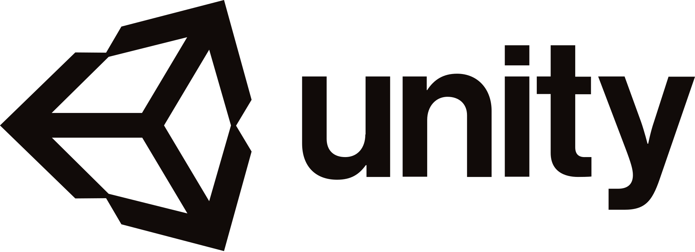

# Présentation
Unity est un moteur de jeu multiplateforme (smartphone, ordinateur, consoles de jeux vidéo et Web) développé par Unity Technologies. Il est l'un des plus répandus dans l'industrie du jeu vidéo, aussi bien pour les grands studios que pour les indépendants du fait de sa rapidité aux prototypages et qu'il permet de sortir les jeux sur tous les supports.

Il a la particularité de proposer une licence gratuite dite « Personal » avec quelques limitations de technologie avancée au niveau de l'éditeur, mais sans limitation au niveau du moteur.

Dans le cadre d'une utilisation d'un casque de réalité virtuel (Oculus Quest) pour la safety box, nous avons prototypé sur Unity.

# Installation et Préparation de Unity
Pour commencer télécharger Unity Hub et Unity Editor [ici](https://unity3d.com/fr/get-unity/download),
pendant le téléchargement il vous proposera plusieurs modules a installer en plus comme Visual studio, android, ios ... Sélectionner Visual studio et android et laisser le reste par défault.

### Setup
Avant de commencer à développer sur Unity, il faut faire quelques préparations:
1. En premier il faut changer de plateforme d'exportation et passer sur Android, (car l'oculus quest est sous une base android, il faut donc lui envoyer des fichiers APK). Aller dans l'onglet file/Build Settings, ensuite sélectionner Android et cliquer sur switch platform.

2. Ensuite nous devons paramétrer Unity de tel sorte à ce qu'il supporte la réalité virtuel. Vous devez aller dans edit/Project Settings, après aller dans l'onglet Player et sélectionner Android et dans XR Settings cocher Virtual Reality supported et avec le + ajouter Oculus.  

   

3. Pour finir il faut importer un package, Window/Asset Store et dans la barre de recherche taper "Oculus Integration" et importer le.

Maintenant tout est en place pour commencer à développer sur Unity.

# Premier pas sur Unity
Nous avons plusieurs onglets notre scene, le point de vu de notre camera, le dossier de notre projet, l'inspector et la hierarchie de notre projet.

Commençons par créer notre environnement de test, tout d'abord on supprime "main camera" dans Hierarchy, ensuite dans la barre de recherche de project taper "OVRPlayerController" et faire un glisser déposer du modèle dans Hierarchy. Ensuite avec Inspector on met la position à 0 pour x,z et z.

On continue avec un clic droit dans hierarchy puis on créer un "plane" et un "cube" avec 3D object et mettre leurs positions à 0. Pour finir on crée d'autres cubes plus petit et on agrandi le premier (Bonus : dans l'Asset du project on peut créer un "material", lui attribuer une couleur et avec un glisser déposer le mettre sur le grand cube) pour obtenir ceci :

Ensuite on clic sur OVRPlayerController et dans l'inspector on fait "Add Component" et on tape "camera constraint" une fois ajouté on fait un glissé déposer de "OVRCameraRig" dans Camera Rig voir

 

Pour finir on sélectionne tout nos petit cubes et dans inspector on clic "Add Component" on ajoute OVR Grabbable et Rigidbody. Et voilà il ne nous reste plus qu'à l'exporter et c'est finis.

 

# Première exportation vers l'Oculus Quest
Pour

### Configuration de l'Oculus Quest en mode développeur

### Installation de SideQuest

### Exportation et installation de notre premier test
